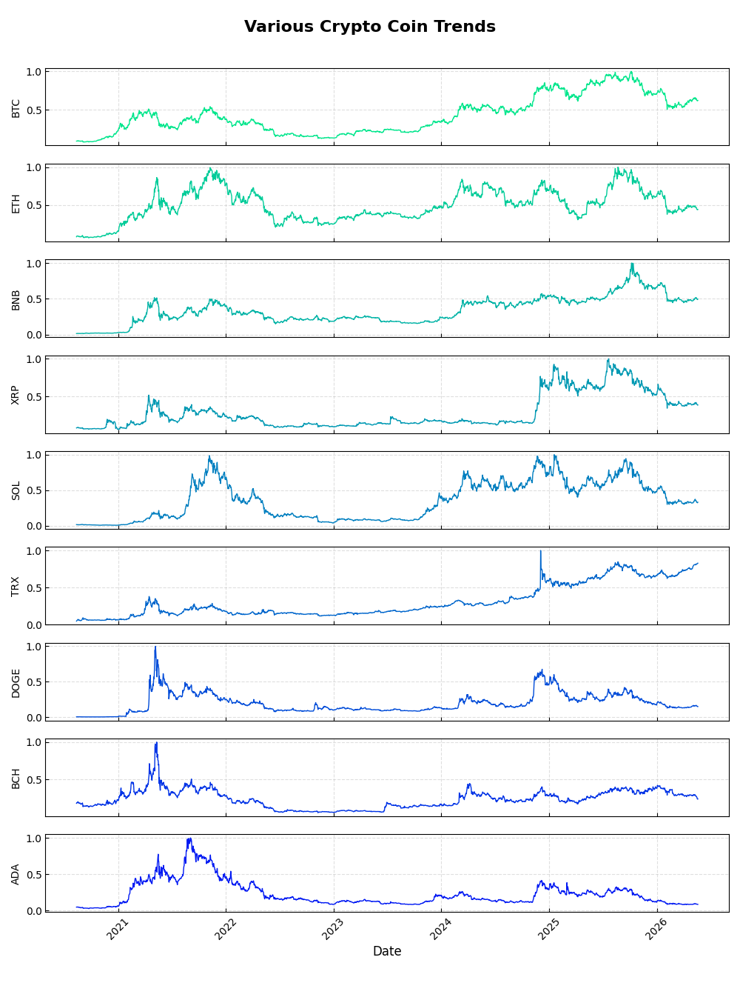
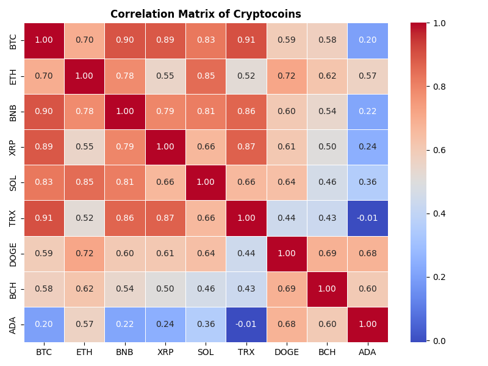
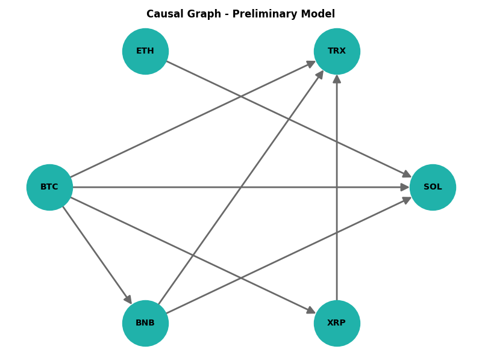
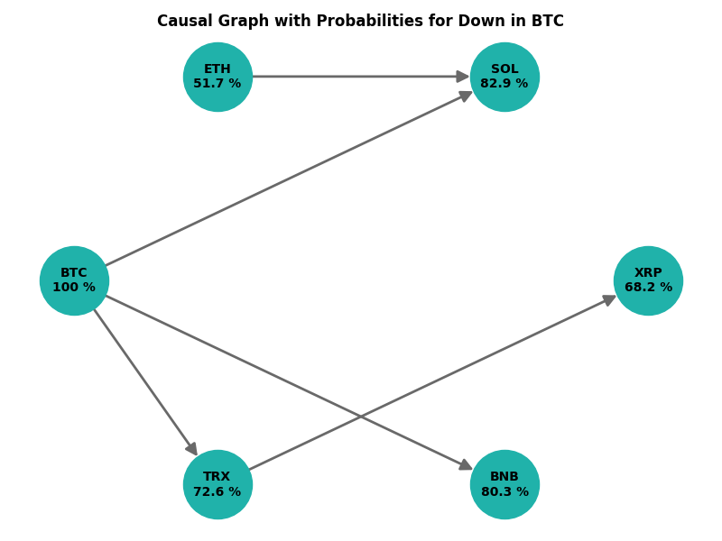
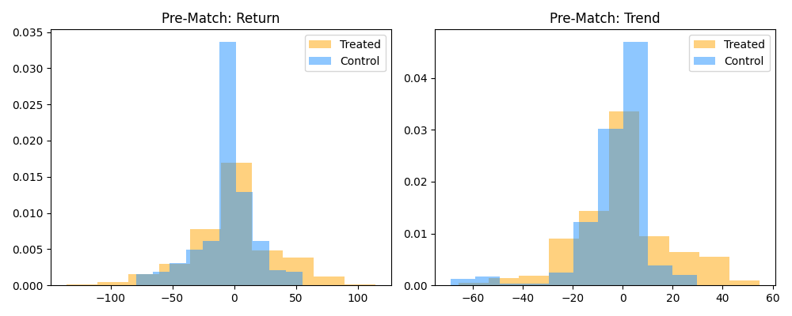

# CausCrypto

## Causal Inference Analysis for Crypto Coins

**CausCrypto**

## Table of Contents

* Description
* Data
* Running the Analysis
* How the code works
* Installation
* File Structure
* License

## Description

* What is CausCrypto? It is an end-to-end Python framework that implements & normalizes daily closing prices for nine major crypto-assets (BTC, ETH, etc.).
* It performs time series tests **Augmented Dickey-Fuller** to assess stationarity. Visualizes trends, correlation matrices and a hand-crafted **Causal Graph**.
* It builds a **Bayesian Network** to compute conditional probability that an alt-coin moves with Bitcoin.
* The constructed **Propensity Score** via **Logistic Regression** matches the treatment (momentun trade) to control the observations. Finally, the **Average Treatment Effect** is estimated for the return and the trend value.
* Why? Many traders believe that strong correlation between Bitcoin / Ethereum and alt-coins is a weak hint of causality. This script lets you move from a correlation to a causal inference pipeline - giving you a quantified probability of a joint up / down move and letting you test a simple momentum strategy.

## Data

The script expects daily CSV downloads from **https://www.cryptodatadownload.com** in the following format (columns show in the original files):

```
'Unix', 'Date', 'Open', 'High', 'Low', 'Close', 'Volume <symbol>', 'tradecount'
```
Place the files in the root folder (or point to another directory by editing the òpen()` path).

> Files included in the repo:
> `Binance_ADAUSDT_d.csv`, `Binance_BCHUSDT_d.csv`, ..., `Binance_SOLUSDT_d.csv`

---

## Running the Analysis
 
```bash
python CausCrypto.py
```

The script prints a quick report to the console:

```
2026-06-15 20:48:11 | INFO     | __main__ | Latest Unix time entry = 1597104000000
2026-06-15 20:48:11 | INFO     | __main__ | Loading data from data/Binance_ADAUSDT_d.csv
2026-06-15 20:48:11 | INFO     | __main__ | Normalizing price data
2026-06-15 20:48:11 | INFO     | __main__ | Prepared normalized data for ADA
2026-06-15 20:48:11 | INFO     | __main__ | Loading data from data/Binance_BCHUSDT_d.csv
2026-06-15 20:48:11 | INFO     | __main__ | Normalizing price data
2026-06-15 20:48:11 | INFO     | __main__ | Prepared normalized data for BCH
2026-06-15 20:48:11 | INFO     | __main__ | Loading data from data/Binance_BNBUSDT_d.csv
2026-06-15 20:48:11 | INFO     | __main__ | Normalizing price data
2026-06-15 20:48:11 | INFO     | __main__ | Prepared normalized data for BNB
2026-06-15 20:48:11 | INFO     | __main__ | Loading data from data/Binance_BTCUSDT_d.csv
2026-06-15 20:48:11 | INFO     | __main__ | Normalizing price data
2026-06-15 20:48:11 | INFO     | __main__ | Prepared normalized data for BTC
2026-06-15 20:48:11 | INFO     | __main__ | Loading data from data/Binance_DOGEUSDT_d.csv
2026-06-15 20:48:11 | INFO     | __main__ | Normalizing price data
2026-06-15 20:48:11 | INFO     | __main__ | Prepared normalized data for DOGE
2026-06-15 20:48:11 | INFO     | __main__ | Loading data from data/Binance_ETHUSDT_d.csv
2026-06-15 20:48:11 | INFO     | __main__ | Normalizing price data
2026-06-15 20:48:11 | INFO     | __main__ | Prepared normalized data for ETH
2026-06-15 20:48:11 | INFO     | __main__ | Loading data from data/Binance_SOLUSDT_d.csv
2026-06-15 20:48:11 | INFO     | __main__ | Normalizing price data
2026-06-15 20:48:11 | INFO     | __main__ | Prepared normalized data for SOL
2026-06-15 20:48:11 | INFO     | __main__ | Loading data from data/Binance_TRXUSDT_d.csv
2026-06-15 20:48:11 | INFO     | __main__ | Normalizing price data
2026-06-15 20:48:11 | INFO     | __main__ | Prepared normalized data for TRX
2026-06-15 20:48:11 | INFO     | __main__ | Loading data from data/Binance_XRPUSDT_d.csv
2026-06-15 20:48:11 | INFO     | __main__ | Normalizing price data
2026-06-15 20:48:11 | INFO     | __main__ | Prepared normalized data for XRP
2026-06-15 20:48:11 | INFO     | __main__ | Stationarity test results:
    Coin  Test Statistics   P-Value  Used Lags
0    ADA        -2.250299  0.188499         22
1    BCH        -2.532250  0.107823         25
2    BNB        -1.453643  0.556306         26
3    BTC        -0.888838  0.791626          1
4   DOGE        -3.018056  0.033242         26
5    ETH        -1.955542  0.306400          6
6    SOL        -1.565070  0.501112          0
7    TRX        -1.886653  0.338366         16
8    XRP        -1.764552  0.398197         17
2026-06-15 20:48:11 | INFO     | __main__ | Latest Unix time entry = 1597104000000
2026-06-15 20:48:11 | INFO     | __main__ | Loading data from data/Binance_BTCUSDT_d.csv
2026-06-15 20:48:12 | INFO     | __main__ | Trend plot saved to output/Trends.png
2026-06-15 20:48:12 | INFO     | __main__ | Correlation matrix computed.
2026-06-15 20:48:12 | INFO     | __main__ | Correlation heatmap saved to output/CorrMatrix.png
2026-06-15 20:48:12 | INFO     | __main__ | Preliminary DAG constructed with 8 edges.
2026-06-15 20:48:12 | INFO     | __main__ | DAG plot saved to output/DAG.png
2026-06-15 20:48:12 | INFO     | __main__ | Bayesian Network fitted.
2026-06-15 20:48:12 | INFO     | __main__ | Node probabilities extracted.
2026-06-15 20:48:12 | INFO     | __main__ | Final DAG plot saved to output/DAG_final.png
2026-06-15 20:48:12 | INFO     | __main__ | Latest Unix time entry = 1597104000000
2026-06-15 20:48:12 | INFO     | __main__ | Latest Unix time entry = 1597104000000
2026-06-15 20:48:12 | INFO     | __main__ | Volatility of BTC: 0.030474
2026-06-15 20:48:12 | INFO     | __main__ | Volatility of SOL: 0.061945
2026-06-15 20:48:12 | INFO     | __main__ | RSI calculated for BTC (window = 14).
2026-06-15 20:48:12 | INFO     | __main__ | RSI calculated for SOL (window = 14).
2026-06-15 20:48:12 | INFO     | __main__ | 30-day SMA calculated for BTC.
2026-06-15 20:48:12 | INFO     | __main__ | 30-day SMA calculated for SOL.
2026-06-15 20:48:12 | INFO     | __main__ | Momentum strategy produced 983 samples.
2026-06-15 20:48:12 | INFO     | __main__ | Propensity scores computed.
2026-06-15 20:48:12 | INFO     | __main__ | Nearest‑neighbour matching completed.
2026-06-15 20:48:12 | INFO     | __main__ | ATE Return: 0.2811 (+/- 39.7815) [CI -90.6500, 88.6200]
2026-06-15 20:48:12 | INFO     | __main__ | ATE Trend: -0.1117 (+/- 18.1479) [CI -43.4982, 37.8697]
2026-06-15 20:48:12 | INFO     | __main__ | Balance histograms saved to output/Histogram.png
2026-06-15 20:48:12 | INFO     | __main__ | Pipeline completed successfully. 
```

---

## How the code works (high-level walk-through)

* *Data Preparation* | Reads CSVs, convert dates to 'datetime', aligns them to common timestanp (`latest_unix`).
* *Normalization* | Scales each coin's `Close`by its maximum value (result `_s`series).
* *ADF* | For each coin, prints the ADF test statistics to gauge stationarity.
* *Visualizations* | Sub-stacked daily closing trend of all nine coins, Heat map of Pearson correlations, and a hand-craft causal graph (BTC → SOL, BTC → TRX, ...)







* *Bayesian Network* | Uses `pomegranate` to specify directed acyclic graph of seven coins with conditional probability tables derived from the Pearson correlations.



* *Momentum strategy* | Generate a binary "treatment" if Solana's trend matches Bitcoin's trend over a 30-day SMA.
* *Propensity Score* | *Logistic Regression* on standardized features to compute `Propensity Score`.
* *Nearest-Neighbor* matching | Matches each treated point with the nearest control within a caliper of 0.05.
* *ATE Calculation* | Substract matched pair Return & Trend to quantify effect sizes. 
Histogram of the return and trend balance of the matched dataset



> **Why a Bayesian network for altcoins?**  
> The network encodes assumed causal drivers (BTC→TRX, BTC→BNB, etc.). After training, it outputs the probability that a “down” move in BTC leads to a “down” in each alt‑coin. 
In the current setting the result is roughly 80 % for BNB, TRX, SOL and XRP, which is the main story used to justify momentum‑based forecasts.

---

## Installation

### Prerequisites

* python 3.12.11
* numpy 2.3.5
* pandas 3.0.2
* matplotlib 3.10.8
* seaborn 0.13.2
* networkx 3.6
* statmodels 0.14.6
* pomegranate 1.1.2
* scikit-learn 1.6.1
* torch | optional for BN conversion
* argparse
* logging
* pathlib
* random
* sys
* pip (Python package manager)
 
### Clone the repo:
```
git clone https://github.com/markus-schindler/CausCrypto.git
cd CausCrypto
```

### Create a virtual environment (optional but recommended)
```
python -m venv /path/to/new/virtual/environment
source /path/to/new/virtual/environment/bin/activate
```

### Install dependencies
```
python -m pip install -r requirements.txt
```

### Usage
```
python CausCrypto.py -h
```
Or use --help to overview all functionalities.
Starting pipeline:
```
python CausCrypto.py
```

## File Structure

├── data **Data source folder**<br/>
├── LICENSE **Unlicense**<br/>
├── output **Folder for created graphics**<br/>
├── README.md **This file**<br/>
├── requirements.txt **Python dependencies**<br/>
└── CausCrypto.py **Main Python application**<br/>

## License

This project is licensed under the Unlicense - see the LICENSE file for details

© 2026 Markus Schindler
