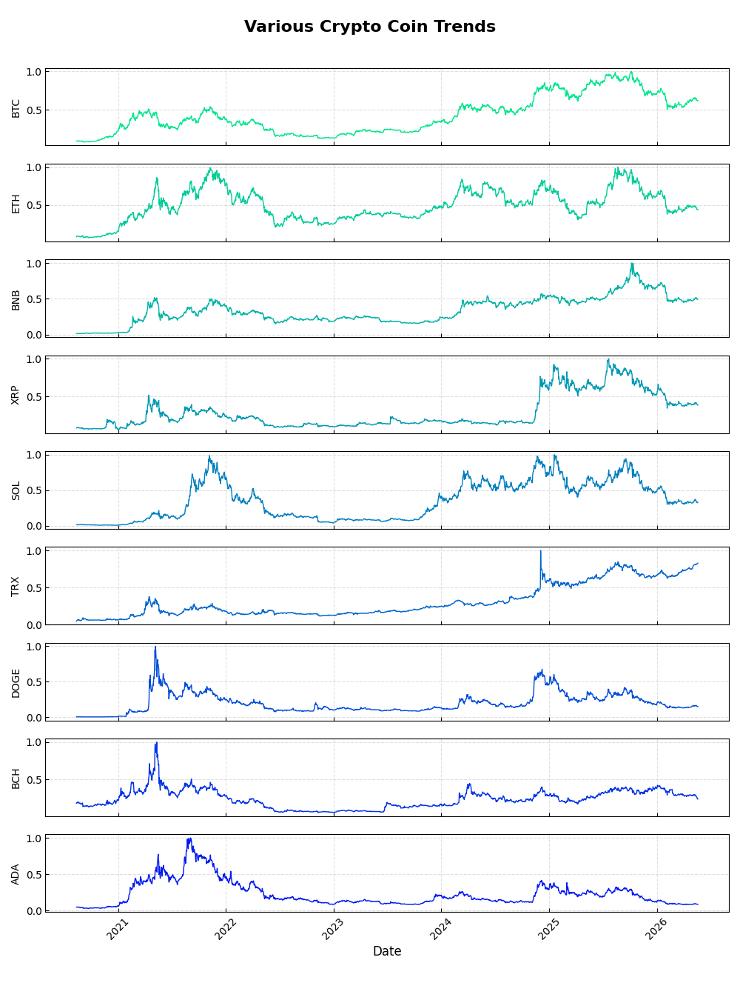
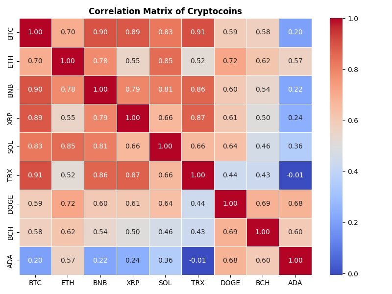
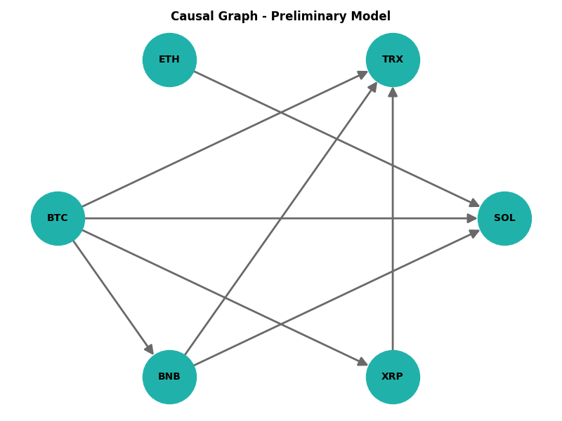
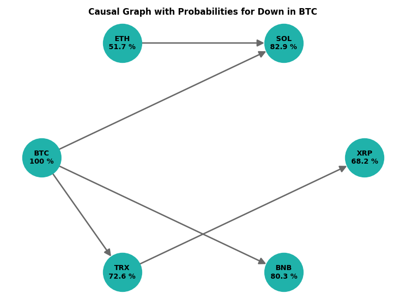
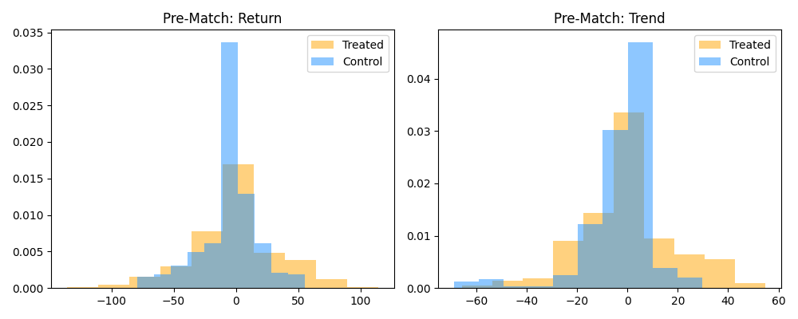

# CausCrypto: Causal Inference Framework for Cryptocurrency Markets

[](https://www.python.org/)
[](https://github.cUnlicense)

**CausCrypto** is a high-performance Python framework designed to move beyond simple correlation analysis in cryptocurrency markets. By implementing a rigorous causal inference pipeline, the tool quantifies the directed influence of market leaders 
(e.g., BTC, ETH) on alt-coins, allowing users to estimate the actual treatment effect of market momentum.

## Overview

In the crypto space, high correlation is often mistaken for causation. **CausCrypto** addresses this by implementing a multi-stage statistical pipeline:

1.  **Stationarity Analysis**: Utilizing the Augmented Dickey-Fuller (ADF) test to ensure time-series validity.
2.  **Causal Discovery**: Constructing Directed Acyclic Graphs (DAGs) and Bayesian Networks to model conditional probabilities of joint asset movements.
3.  **Effect Estimation**: Implementing Propensity Score Matching (PSM) via Logistic Regression to isolate the **Average Treatment Effect (ATE)** of a momentum trade, controlling for confounding variables.

## Technical Pipeline

### 1. Data Preprocessing & Validation
The framework normalizes daily closing prices and performs stationarity checks to prevent spurious regressions. Data can be dowloaded from **https://www.cryptodatadownload.com**.
*   **Normalization**: Max-scaling of price series for comparative analysis.
*   **Stationarity**: ADF tests are applied to each asset to evaluate the order of integration.

### 2. Structural Modeling (Bayesian Networks)
Instead of simple heatmaps, CausCrypto uses **Bayesian Networks** (via `pomegranate`) to encode the causal hierarchy of the market.
*   **DAG Construction**: Defines the flow of influence (e.g., $BTC \rightarrow SOL$).
*   **Conditional Probability**: Computes the probability $P(\text{Altcoin}_{\text{up}} \mid \text{BTC}_{\text{up}})$, providing a quantified basis for momentum strategies.

### 3. Causal Inference (Propensity Score Matching)
To quantify the impact of a "treatment" (e.g., a BTC momentum signal) on an alt-coin's return:
*   **Treatment Assignment**: Binary classification based on 30-day SMA alignment.
*   **Propensity Scoring**: A Logistic Regression model estimates the probability of treatment.
*   **Matching**: Nearest-Neighbor matching within a strict caliper (0.05) to create a balanced control group.
*   **ATE Estimation**: Calculation of the Average Treatment Effect on returns and trends.

---

## Visualizations
The pipeline automatically generates the following analytical artifacts in the `/output` directory:
*   **Price Trends**: Normalized comparative time-series.
*   **Correlation Matrix**: Pearson coefficients for baseline analysis.
*   **Causal DAGs**: Visual representation of the Bayesian Network structure.
*   **Balance Histograms**: Comparison of treated vs. control groups post-matching.



**Figure 1:** Normalized time-series for investigated crypto coins.



**Figure 2:** Correlation matrix with Pearson coefficients.



**Figure 3:** First DAG using the Pearson coefficients.



**Figure 4:** Updated DAG based on Bayesian Network.



**Figure 5:** Using Propensity Scoring to compare treated vs. control groups.

---

## Installation & Usage

```bash
# Clone the repository
git clone https://github.com/markus-schindler/CausCrypto.git
cd CausCrypto

# Create a virtual environment (optional but recommended)
python -m venv /path/to/new/virtual/environment
source /path/to/new/virtual/environment/bin/activate

# Install dependencies
pip install -r requirements.txt

# Run the full analysis pipeline:
python CausCrypto.py

# For advanced configuration, use the help flag:
python CausCrypto.py --help
```

## Project Structure
```text
├── data/               # Market data (CSV format)
├── output/             # Generated plots and analysis reports
├── CausCrypto.py       # Main execution engine
├── README.md           # This file
├── requirements.txt    # Dependency list
└── LICENSE             # Unlicense
```

## License

This project is licensed under the Unlicense - see the LICENSE file for details

© 2026 Markus Schindler
